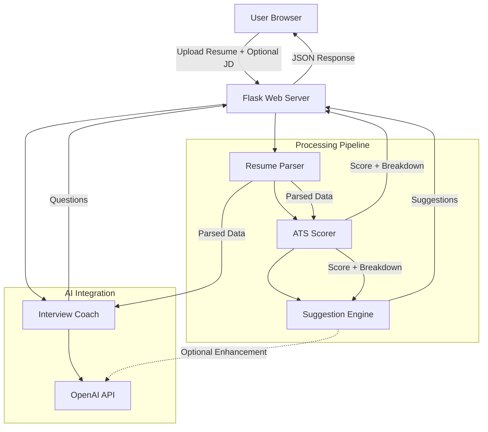

# Design Document

## Overview

The AI Resume & Interview Coach is a Python-based web application built with Flask that provides resume analysis and interview preparation services. The system follows a pipeline architecture where an uploaded resume flows through parsing, scoring, suggestion generation, and interview question generation stages.

**Key Design Decisions:**

- **Python + Flask**: Chosen for simplicity, rapid development, and rich ecosystem of document processing libraries. Flask's lightweight nature suits the single-page application requirement.
- **PyMuPDF (fitz) for PDF parsing**: High-performance PDF text extraction with reliable handling of various PDF formats. Pure Python alternative pypdf is slower and less reliable with complex layouts.
- **python-docx for DOCX parsing**: The standard Python library for reading Word documents, well-maintained and straightforward.
- **OpenAI API for AI features**: Used for interview question generation and intelligent suggestion generation. Provides high-quality natural language output with structured response support.
- **Rule-based ATS scoring**: The ATS scorer uses deterministic, rule-based evaluation rather than AI to ensure consistent, explainable scores. This makes the scoring logic testable and predictable.
- **No database**: For simplicity, the application processes resumes in-memory per request. No user accounts or persistence beyond the session.

## Architecture

The application follows a layered pipeline architecture with clear separation between the web layer, processing modules, and AI integration.



**Request Flow:**

1. User uploads a resume file (PDF/DOCX) and optionally provides a job description
2. Flask validates the file (type, size) and passes it to the Resume Parser
3. Resume Parser extracts text and identifies sections
4. ATS Scorer evaluates the parsed resume against scoring criteria
5. Suggestion Engine generates improvement recommendations based on scores
6. Interview Coach generates practice questions (triggered separately by user)
7. Results are returned as JSON and rendered in the frontend

## Components and Interfaces

### 1. Web Layer (`app.py`)

The Flask application handles HTTP requests, file validation, and response formatting.

```python
# POST /api/analyze
# Accepts: multipart/form-data with 'resume' file and optional 'job_description' text
# Returns: JSON with parsed_resume, ats_score, suggestions

# POST /api/interview-questions
# Accepts: JSON with parsed_resume data and optional job_description
# Returns: JSON with generated interview questions
```

### 2. Resume Parser (`resume_parser.py`)

```python
class ResumeParser:
    def parse(self, file_bytes: bytes, filename: str) -> ParsedResume:
        """
        Extract text and identify sections from a resume file.
        
        Args:
            file_bytes: Raw file content
            filename: Original filename (used to determine format)
            
        Returns:
            ParsedResume with sections and raw text
            
        Raises:
            FileFormatError: If file is not PDF or DOCX
            EmptyFileError: If file is empty or has no extractable text
            FileSizeError: If file exceeds 5MB
        """
        pass

    def _extract_pdf(self, file_bytes: bytes) -> str:
        """Extract text from PDF using PyMuPDF."""
        pass

    def _extract_docx(self, file_bytes: bytes) -> str:
        """Extract text from DOCX using python-docx."""
        pass

    def _identify_sections(self, text: str) -> dict[str, Section]:
        """
        Identify resume sections using heading pattern matching.
        Returns dict mapping section type to Section object.
        Only includes sections that were successfully identified.
        """
        pass
```

### 3. ATS Scorer (`ats_scorer.py`)

```python
class ATSScorer:
    def score(self, parsed_resume: ParsedResume, job_description: str | None = None) -> ATSResult:
        """
        Calculate ATS compatibility score.
        
        Args:
            parsed_resume: Structured resume data from parser
            job_description: Optional job description for tailored scoring
            
        Returns:
            ATSResult with overall score and criterion breakdown
        """
        pass

    def _score_keyword_relevance(self, parsed_resume: ParsedResume, job_description: str | None) -> int:
        """Score 0-100 for keyword relevance."""
        pass

    def _score_formatting(self, parsed_resume: ParsedResume) -> int:
        """Score 0-100 for formatting compatibility."""
        pass

    def _score_section_completeness(self, parsed_resume: ParsedResume) -> int:
        """Score 0-100 for section completeness."""
        pass

    def _score_contact_info(self, parsed_resume: ParsedResume) -> int:
        """Score 0-100 for contact information presence."""
        pass
```

### 4. Suggestion Engine (`suggestion_engine.py`)

```python
class SuggestionEngine:
    def generate(self, parsed_resume: ParsedResume, ats_result: ATSResult, job_description: str | None = None) -> list[Suggestion]:
        """
        Generate improvement suggestions based on scoring results.
        
        Returns:
            List of 1-10 Suggestion objects ordered by priority (high to low)
        """
        pass

    def _check_missing_keywords(self, parsed_resume: ParsedResume, job_description: str | None) -> list[Suggestion]:
        pass

    def _check_formatting_issues(self, parsed_resume: ParsedResume) -> list[Suggestion]:
        pass

    def _check_weak_verbs(self, parsed_resume: ParsedResume) -> list[Suggestion]:
        pass

    def _check_quantifiable_achievements(self, parsed_resume: ParsedResume) -> list[Suggestion]:
        pass

    def _check_section_improvements(self, parsed_resume: ParsedResume, ats_result: ATSResult) -> list[Suggestion]:
        pass
```

### 5. Interview Coach (`interview_coach.py`)

```python
class InterviewCoach:
    def generate_questions(self, parsed_resume: ParsedResume, job_description: str | None = None) -> list[InterviewQuestion]:
        """
        Generate 5-15 interview practice questions using OpenAI API.
        
        Returns:
            List of InterviewQuestion objects with at least one from each category
            (behavioral, technical, experience-based)
        """
        pass
```

### 6. Frontend (`templates/index.html`, `static/`)

Single-page application using vanilla HTML/CSS/JavaScript with fetch API for async communication with the backend. No frontend framework to keep complexity low.

## Data Models

```python
from dataclasses import dataclass, field
from enum import Enum


class SectionType(Enum):
    EXPERIENCE = "experience"
    EDUCATION = "education"
    SKILLS = "skills"
    SUMMARY = "summary"


@dataclass
class Section:
    section_type: SectionType
    heading: str        # The actual heading text found in the resume
    content: str        # The text content of the section


@dataclass
class ParsedResume:
    raw_text: str
    sections: dict[SectionType, Section]  # Only includes identified sections
    word_count: int
    filename: str


@dataclass
class ATSCriterionScore:
    criterion: str      # e.g., "keyword_relevance", "formatting"
    score: int          # 0-100
    details: str        # Human-readable explanation


@dataclass
class ATSResult:
    overall_score: int  # 0-100, weighted average of criteria
    criteria: list[ATSCriterionScore]
    warning: str | None = None  # Set if word_count < 50


class Priority(Enum):
    HIGH = "high"       # Reduces ATS score by 10+ points
    MEDIUM = "medium"   # Reduces ATS score by 5-9 points
    LOW = "low"         # Minor optimization opportunity


class SuggestionCategory(Enum):
    MISSING_KEYWORDS = "missing_keywords"
    FORMATTING = "formatting"
    WEAK_VERBS = "weak_verbs"
    QUANTIFIABLE_ACHIEVEMENTS = "quantifiable_achievements"
    SECTION_IMPROVEMENT = "section_improvement"


@dataclass
class Suggestion:
    category: SuggestionCategory
    priority: Priority
    issue: str          # Description of the issue found
    recommendation: str # Specific recommended change


class QuestionCategory(Enum):
    BEHAVIORAL = "behavioral"
    TECHNICAL = "technical"
    EXPERIENCE_BASED = "experience_based"


@dataclass
class AnswerFramework:
    structure: str          # e.g., "Situation, Action, Result"
    key_points: list[str]   # Points to address from the resume
    recommended_length: int # Number of sentences (3-8)


@dataclass
class InterviewQuestion:
    category: QuestionCategory
    question: str
    answer_framework: AnswerFramework
```

## Correctness Properties

*A property is a characteristic or behavior that should hold true across all valid executions of a system—essentially, a formal statement about what the system should do. Properties serve as the bridge between human-readable specifications and machine-verifiable correctness guarantees.*

### Property 1: Section identification preserves content

*For any* valid resume text containing identifiable sections (experience, education, skills, summary), parsing the text and then concatenating all returned section contents should produce text that is a subset of the original input text (no content is fabricated).

**Validates: Requirements 1.1**

### Property 2: Invalid file format rejection

*For any* filename whose extension is not `.pdf` or `.docx` (case-insensitive), the Resume Parser shall raise a FileFormatError without attempting text extraction.

**Validates: Requirements 1.2**

### Property 3: Partial parsing returns identified subset

*For any* resume text, the set of section types returned by the parser shall be a subset of {experience, education, skills, summary}, and every returned section shall have non-empty content.

**Validates: Requirements 1.5**

### Property 4: ATS score range and structure invariant

*For any* valid ParsedResume, the ATS Scorer shall return an ATSResult where: the overall_score is an integer in [0, 100], the criteria list contains exactly four entries (keyword_relevance, formatting, section_completeness, contact_info), and each criterion score is an integer in [0, 100].

**Validates: Requirements 2.1, 2.2, 2.4**

### Property 5: Job description matching improves keyword relevance

*For any* ParsedResume containing identifiable keywords, scoring with a Job Description that contains those same keywords shall produce a keyword_relevance sub-score greater than or equal to scoring with a Job Description containing none of those keywords.

**Validates: Requirements 2.3**

### Property 6: Low word count triggers warning

*For any* ParsedResume with word_count < 50, the ATSResult shall contain a non-null warning. *For any* ParsedResume with word_count >= 50, the ATSResult shall have warning equal to None.

**Validates: Requirements 2.5**

### Property 7: Suggestion count bounds

*For any* valid ParsedResume and ATSResult (where the resume has sufficient content for analysis), the Suggestion Engine shall return between 1 and 10 suggestions inclusive.

**Validates: Requirements 3.1, 3.5**

### Property 8: Suggestion validity

*For any* suggestion returned by the Suggestion Engine, its priority shall be one of {high, medium, low} and its category shall be one of {missing_keywords, formatting, weak_verbs, quantifiable_achievements, section_improvement}.

**Validates: Requirements 3.2, 3.3**

### Property 9: Job description triggers keyword suggestion

*For any* ParsedResume and Job Description where the Job Description contains at least one keyword not present in the resume, the Suggestion Engine shall return at least one suggestion with category "missing_keywords" that references a keyword from the Job Description.

**Validates: Requirements 3.4**

### Property 10: Suggestion priority ordering

*For any* list of suggestions returned by the Suggestion Engine, the suggestions shall be ordered such that all high-priority suggestions appear before medium-priority suggestions, and all medium-priority suggestions appear before low-priority suggestions.

**Validates: Requirements 3.5**

### Property 11: Question generation invariants

*For any* valid ParsedResume with sufficient content (3+ identifiable skills/experiences), the Interview Coach shall generate between 5 and 15 questions, with at least one question from each category (behavioral, technical, experience_based).

**Validates: Requirements 4.2, 4.3**

### Property 12: Answer framework validity

*For any* InterviewQuestion generated by the Interview Coach, the answer_framework shall have a non-empty structure string, a non-empty key_points list, and a recommended_length integer between 3 and 8 inclusive.

**Validates: Requirements 4.5**

### Property 13: Short job description treated as absent

*For any* string with fewer than 20 characters provided as a Job Description, the application shall treat it as if no Job Description was provided (no tailoring applied, same results as null JD).

**Validates: Requirements 6.4**

## Error Handling

### Error Types and Responses

| Error | Module | User Message | HTTP Status |
|-------|--------|-------------|-------------|
| `FileFormatError` | Resume Parser | "Unsupported file format. Please upload a PDF or DOCX file." | 400 |
| `EmptyFileError` | Resume Parser | "The uploaded file is empty or contains no extractable text." | 400 |
| `FileSizeError` | Resume Parser | "File exceeds the maximum size of 5MB." | 413 |
| `ScoringError` | ATS Scorer | "Unable to complete scoring. Please try again." | 500 |
| `InsufficientContentError` | Suggestion Engine | "Resume content is insufficient for analysis. Please verify your uploaded file." | 422 |
| `AIServiceError` | Interview Coach | "Unable to generate interview questions. Please try again later." | 503 |

### Error Handling Strategy

1. **Validation errors** (file format, size, empty): Return immediately with descriptive error message. No partial processing.
2. **Processing errors** (scoring failure): Return error with retry suggestion. Log the error server-side for debugging.
3. **AI service errors** (OpenAI timeout/failure): Return graceful error with retry suggestion. Implement a 10-second timeout for AI calls.
4. **Partial success**: The parser returns whatever sections it can identify (Requirement 1.5). The pipeline continues with partial data rather than failing entirely.

### Input Validation

- File type: Checked by extension and MIME type before processing
- File size: Checked before reading file content into memory
- Job description length: Strings < 20 characters treated as not provided; strings > 5000 characters truncated at 5000

## Testing Strategy

### Property-Based Tests (Hypothesis)

The project will use [Hypothesis](https://hypothesis.readthedocs.io/) for property-based testing in Python. Each property test runs a minimum of 100 iterations.

**Configuration:**
```python
from hypothesis import settings

@settings(max_examples=100)
```

**Properties to implement:**
- Property 1-3: Resume Parser properties (section preservation, format rejection, partial parsing)
- Property 4-6: ATS Scorer properties (score invariants, JD matching, warning logic)
- Property 7-10: Suggestion Engine properties (count bounds, validity, JD trigger, ordering)
- Property 11-12: Interview Coach properties (question invariants, framework validity) — using mocked AI responses
- Property 13: Job description validation property

Each test will be tagged with:
```python
# Feature: ai-resume-interview-coach, Property {N}: {property_text}
```

### Unit Tests (pytest)

Unit tests cover specific examples, edge cases, and error conditions:

- **Resume Parser**: Empty file handling, 0-byte files, files at exactly 5MB boundary, various PDF/DOCX structures
- **ATS Scorer**: Scoring failure scenarios, resumes with exactly 50 words (boundary)
- **Suggestion Engine**: Insufficient content fallback, maximum 10 suggestions cap
- **Interview Coach**: Fewer than 3 skills fallback, AI timeout handling
- **Web Layer**: File upload validation, response format, error responses
- **Job Description**: Exactly 20 characters (boundary), exactly 5000 characters (boundary)

### Integration Tests

- End-to-end upload flow with sample PDF and DOCX files
- Full pipeline with and without job description
- Frontend rendering of results (manual or Playwright)
- AI service integration with real API (limited, not in CI)

### Test Organization

```
tests/
├── unit/
│   ├── test_resume_parser.py
│   ├── test_ats_scorer.py
│   ├── test_suggestion_engine.py
│   └── test_interview_coach.py
├── property/
│   ├── test_parser_properties.py
│   ├── test_scorer_properties.py
│   ├── test_suggestion_properties.py
│   ├── test_interview_properties.py
│   └── test_validation_properties.py
├── integration/
│   └── test_full_pipeline.py
└── conftest.py  # Shared fixtures and Hypothesis strategies
```

